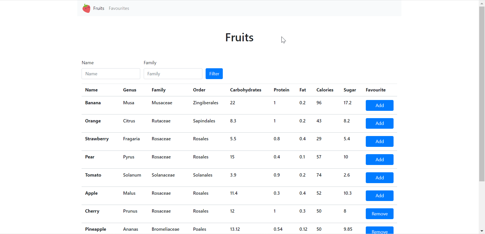

# Fruityvice.com Api

This project was generated with Symfony v5.4(PHP 8.1) as Backend, Vue 3 as Frontend.
DB is MySQL

## Rum server

Download symfony and set system environment variables.

`symfony server:start`

## DB migration

Run following the commands:

`php bin/console doctrine:database:create`

Create Entity, Repository

`php bin/console make:migrations`

`php bin/console doctrine:migration:migrate`

## Make Command

`php bin/console make:command`

`app:fruit`

Then modify FruitCommand.php in src/Command

Call `php bin/console app:fruit:send`
